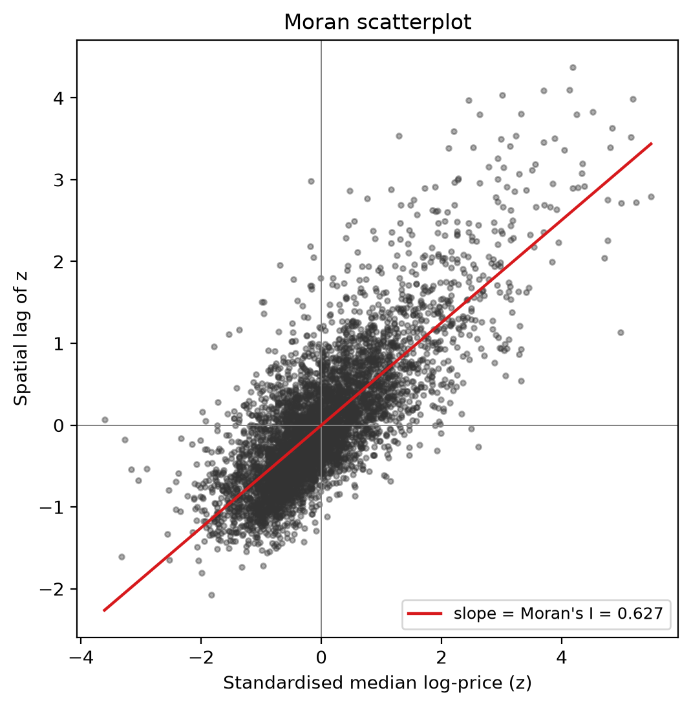
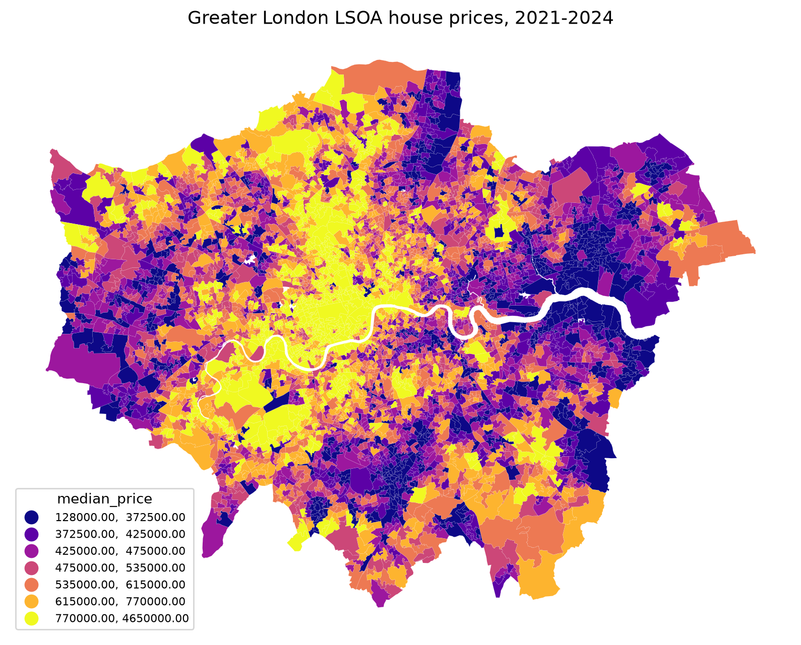
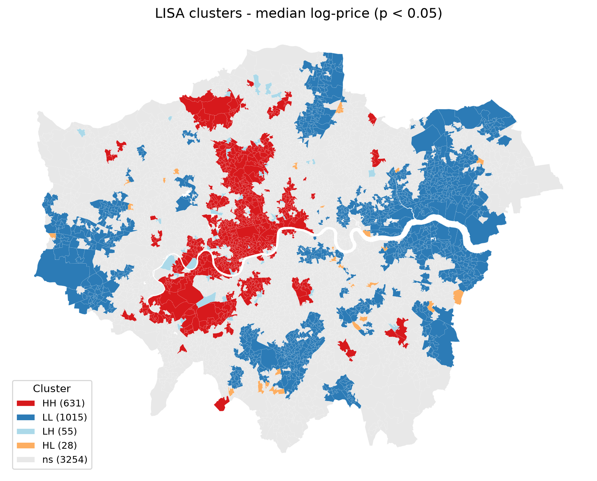
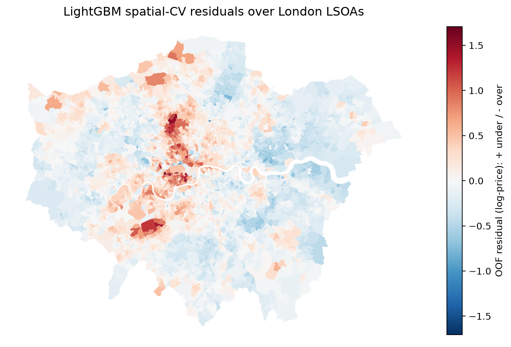
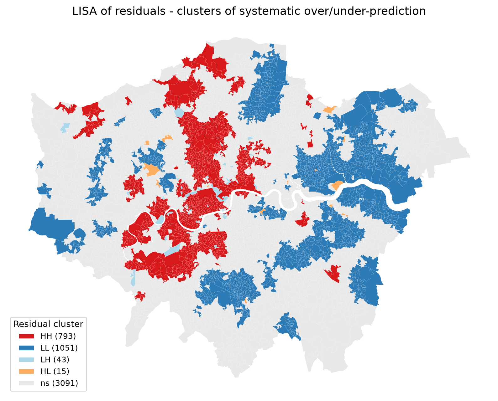
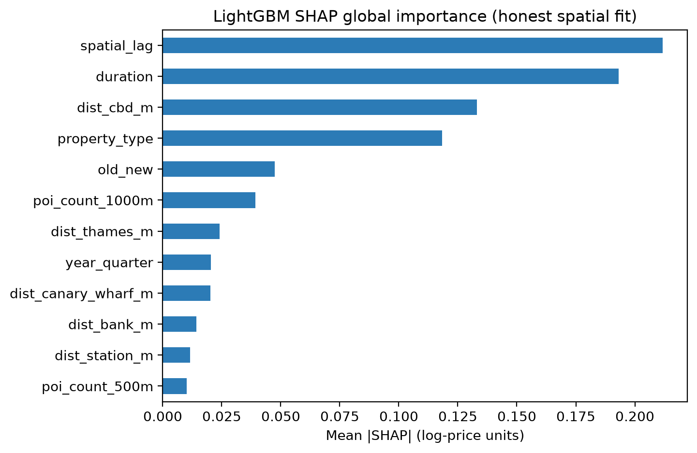
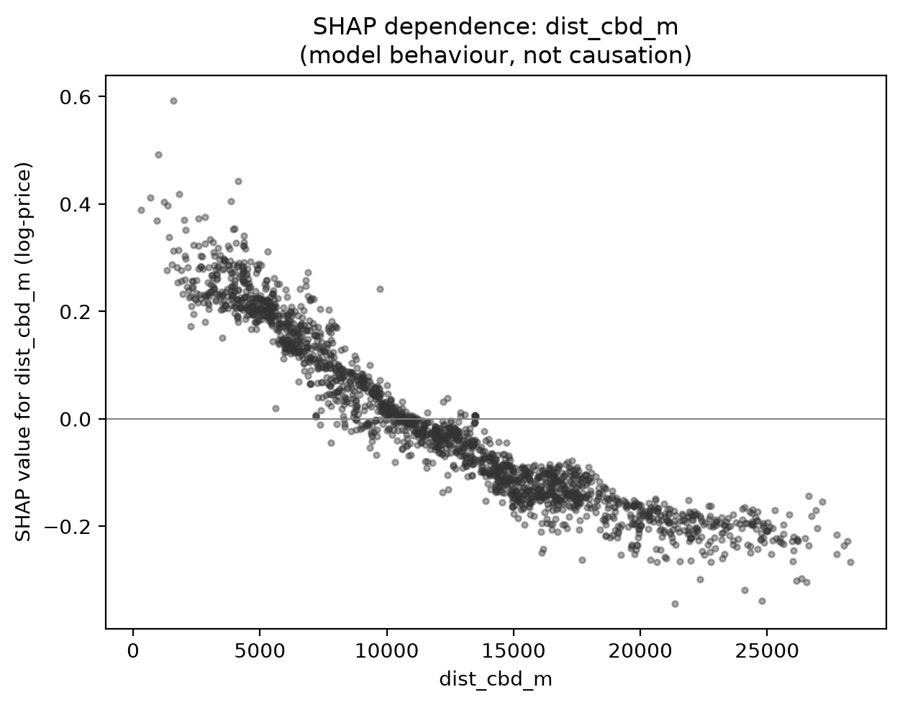

# Spatial House-Price Modelling for Greater London

**How much of a house-price model's accuracy is real, and how much is it quietly memorising the neighbourhood it was tested on?**

This project answers that question empirically on ~375,000 real Greater London property transactions (2021 to 2024). It shows that the standard evaluation used in almost every house-price notebook, random k-fold cross-validation, *overstates* generalisation by silently leaking neighbourhood signal, and it measures the size of that illusion with a spatially honest protocol.

The headline result, in one line:

> A LightGBM that looks like it explains **70%** of price variance under random CV explains only **38%** under spatially honest CV. The 32-point gap is leakage, not skill.

---

## Why this is not "yet another house-price notebook"

House prices are strongly spatially autocorrelated: adjacent homes share schools, transport, views, and prestige, so their prices are nearly identical. When you shuffle transactions into random folds, near-neighbours land in both train and test, and the model effectively memorises *where* a property is rather than learning *what makes it worth that price*. The reported score looks great and collapses the moment the model sees a genuinely new neighbourhood.

This repository treats that leakage as the object of study rather than an accident to ignore. Every design choice, from the areal unit to the fold construction to where features are fitted, exists to measure it honestly.

---

## The argument, end to end

The whole project is a single chain of evidence. Each figure is one link.

### 1. Prices cluster in space (so leakage is possible)

Aggregating transactions to LSOA and measuring global spatial autocorrelation on median log-price:

| Weights | Moran's I | z | p |
|---|---|---|---|
| Queen contiguity | **0.627** | 74.1 | 0.001 |
| KNN (k=8) | **0.574** | 82.7 | 0.001 |

Both weighting schemes agree, so the result is not an artefact of one adjacency definition. `Moran's I ~ 0.63` is strong positive autocorrelation.



The Moran scatterplot *is* the leakage risk made visible: a neighbourhood's price predicts its neighbours' prices with slope 0.627. Local indicators (LISA) locate the structure, a hot core through central and west London, cold clusters to the east and outer edges:




An interactive version is at `reports/figures/choropleth_interactive.html`.

### 2. Honest evaluation vs. the illusion (the headline)

The same models are run under three schemes:

- **random**: naive 5-fold, shuffled transactions (the inflated baseline);
- **spatial**: 5 KMeans-clustered *contiguous* LSOA blocks, so whole regions are held out unseen;
- **spatial_buffered**: spatial blocks with a 1 km dead-zone removed around each held-out block, to kill adjacency leakage across fold edges.

Every area-level and spatial-lag feature is fitted **inside each fold on training rows only**, under all three schemes. Using a validation area's own prices to build its features would reintroduce exactly the leak we are measuring.

**R2 (mean across folds):**

| Model | random | spatial | spatial_buffered |
|---|---|---|---|
| LightGBM | **0.700** | **0.384** | 0.351 |
| Ridge (with spatial features) | 0.618 | 0.342 | 0.324 |
| Ridge (no spatial features) | 0.513 | 0.373 | 0.369 |
| Lasso (with spatial features) | 0.617 | 0.334 | 0.314 |
| Spatial kNN | 0.618 | **-0.715** | -0.718 |
| Global mean | 0.000 | -0.199 | -0.213 |

Two things jump out:

- **LightGBM drops from 0.70 to 0.38.** The random score is not the model's real skill; roughly half of it was leaked neighbourhood identity. The honest score is still healthily positive, so the model *does* generalise, just far less than random CV claims.
- **Spatial kNN goes from 0.62 to -0.72.** A model whose only trick is "look at nearby sales" looks competitive under random CV and becomes *worse than predicting the mean* under spatial CV. It is the purest demonstration of the leak: take its neighbours away and nothing remains.

Notice too that under honest CV, LightGBM (0.384) barely beats Ridge *without* spatial features (0.373): the spatial-lag feature that dominates under random CV loses almost all its value once evaluation is honest. Leaky features are worth what an honest protocol says they are worth.

### 3. Where the model is still wrong (residual diagnostics)

If a model had fully captured the spatial surface, its residuals would be spatial noise. They are not:

| Residuals from | Moran's I | p |
|---|---|---|
| random CV | 0.040 | 0.001 |
| spatial CV | **0.719** | 0.001 |

Under random CV the model absorbs the spatial structure (residual `I ~ 0`), because it was allowed to memorise it. Under honest CV the structure it *couldn't* see resurfaces in the residuals (`I = 0.72`), and the maps show exactly where:




Red marks where the model systematically under-predicts (central/inner-west London); blue marks systematic over-prediction (east/outer). These are the regions whose price level could only have been learned from neighbours the honest protocol withheld.

### 4. What drives the model, and how uncertain it is

SHAP on the honestly-fitted LightGBM (explaining the model, **not** causation):




Distance-to-CBD is the strongest *engineered* driver, and its dependence curve is clean and monotone: proximity pushes predicted price up, tapering off beyond ~11 km. (This is the model's behaviour; the effect is confounded by everything correlated with location.)

Uncertainty is quantified with **conformalised quantile regression** (CQR), and evaluated two ways to mirror the CV contrast:

| Test set | Target coverage | Achieved coverage |
|---|---|---|
| random split (exchangeability holds) | 90% | **89.9%** |
| spatially held-out region (shift) | 90% | **81.9%** |

Even the *uncertainty* guarantee degrades under spatial shift: a "90%" interval only contains the true price 82% of the time in an unseen region. The leakage story extends beyond point predictions to calibration.

---

## Data

| Source | Role | Licence |
|---|---|---|
| HM Land Registry Price Paid Data (2021 to 2024) | transactions, prices, property attributes | OGL v3.0 |
| ONS Postcode Directory (ONSPD) | postcode to BNG coordinates + LSOA/MSOA/LAD | OGL v3.0 |
| ONS LSOA (Dec 2021) boundaries, BGC | choropleths, adjacency, spatial blocking | OGL v3.0 |
| OpenStreetMap (Geofabrik Greater London) | Thames, stations, POIs | ODbL |

**Modelling design.** The ML row is one **Category-A** (arm's-length) residential transaction; the **LSOA (2021)** is the areal scaffold for autocorrelation, spatial-lag features, and spatial blocking. Target is **log-price** (right-skewed prices, variance stabilised). Ingestion runs a real geocoding pipeline: PPD ships with no coordinates, so postcodes are normalised and joined to ONSPD centroids (99.99% match rate), reprojected in EPSG:27700 for metric distance work, and reprojected to EPSG:4326 only for display. Full cleaning funnel: 4.15M England-and-Wales rows, then 467k Greater London (LAD prefix `E09`), then 375k after Category-A, property-type, dedupe, and price-sanity filters.

---

## Reproducing the results

### 1. Environment

```bash
conda create -n london -c conda-forge python=3.12 \
  geopandas libpysal esda mapclassify folium lightgbm shap numba \
  pandas numpy pyproj scipy scikit-learn pyarrow requests matplotlib -y
conda activate london
```

(The geospatial stack, GDAL/GEOS/PROJ, installs far more cleanly via conda-forge than pip.)

### 2. Place the external data

Price Paid Data downloads automatically. The rest are one-time manual downloads placed under `data/external/`:

| File to place | Source |
|---|---|
| `ONSPD.csv` | ONS Open Geography Portal, "ONS Postcode Directory" (single UK CSV) |
| `LSOA_2021_EW_BGC.geojson` | ONS Open Geography Portal, "LSOA (Dec 2021) Boundaries EW BGC", GeoJSON |
| `thames.geojson`, `london_stations.geojson`, `london_pois.geojson` | Geofabrik Greater London extract, sliced by `scripts/prepare_osm_layers.py` |

> **ONSPD column names drift between releases.** If ingestion raises a `KeyError`, update `ONSPD_COLUMNS` in `src/data/config.py` to match your release (e.g. `east1m`, `north1m`, `lsoa21cd`, `msoa21cd`, `lad25cd`).

### 3. Run the pipeline in order

```bash
python -m src.data.ingest                    # geocode, filter to London, clean, write parquet
python -m src.eda.spatial_autocorrelation    # Moran's I, LISA, choropleths
python -m src.features.build_features         # distance + POI-density features
python -m src.models.evaluate                 # the money table: random vs spatial CV
python run_interpret.py                       # SHAP, CQR intervals, residual maps
```

Outputs land in `reports/` (metrics as CSV/JSON) and `reports/figures/` (all figures).

### 4. Tests

```bash
pytest -q     # 17 smoke tests: cleaning rules, the geocoding join, fold-safety proofs
```

The fold-safety tests are the important ones: they assert that a validation area's own target can never enter its spatial-lag feature.

---

## Repository layout

```
src/
  data/       ingest.py            PPD download, ONSPD geocoding join, cleaning funnel
  eda/        spatial_autocorrelation.py   LSOA aggregation, Moran's I, LISA, maps
  features/   build_features.py    distance-to-CBD/Thames/stations, POI density
              spatial_lag.py       fold-safe SpatialLagTransformer (fit on train only)
  models/     cv.py                random k-fold + KMeans spatial blocks (buffered)
              evaluate.py          the (model x scheme) money table + residual Moran's I
  interpret/  explain.py           SHAP on the honest fit
              uncertainty.py       conformalised quantile regression
              residual_maps.py     residual choropleth + residual LISA
tests/        five smoke suites, incl. three fold-safety proofs
reports/      metrics + figures
```

---

## Methodological notes worth an interviewer's attention

- **Fold-internal feature fitting.** The spatial lag, scaler, and encoders are re-fit inside every fold on training rows only. This is the single most common, and most invisible, source of spatial leakage.
- **Contiguous spatial blocks, not a grid.** Blocks are KMeans clusters of LSOA centroids, so each held-out fold is a compact, connected region. The optional 1 km buffer removes training points hugging the fold edge.
- **Log-price with honest price-scale reporting.** Metrics are computed on log-price; where a mean-based price error is reported, a Duan smearing correction is applied (naively exponentiating log-predictions is biased low).
- **Distance-to-Thames as a deliberate coast proxy.** London is inland, so the brief's "distance-to-coast" resolves to distance-to-Thames, which carries a genuine riverside premium. It is labelled as a proxy, not literal coast.
- **Synthetic-fixture testing.** Every module ships a smoke test against synthetic geometry with known properties, so the pipeline logic is verifiable independently of the large, externally-hosted real data.

---

## Attribution

Contains HM Land Registry data (c) Crown copyright and database right 2026. Contains OS data (c) Crown copyright and database right 2026. Contains Royal Mail data (c) Royal Mail copyright and database right 2026. Contains National Statistics data (c) Crown copyright and database right 2026. Licensed under the Open Government Licence v3.0. OpenStreetMap data (c) OpenStreetMap contributors, licensed under the ODbL.
